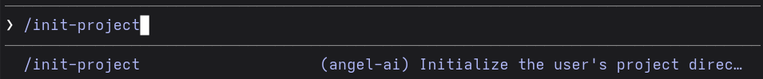
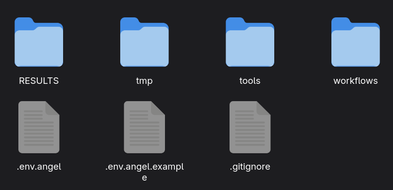
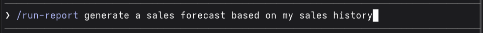

# Angel AI
#### An agentic data analysis and machine learning plugin for Claude code
___
## Why is this important?
This Plugin acts as a data analyst agent. The goal is to minimize costs as much as possible for early stage startups, so they can make informed decisions at a lower cost.
___

## Prerequisites
**1.** You must have a paid Claude plan.
**2.** Install [Claude CLI](https://shellypalmer.com/how-to-set-up-claude-code-cli-beginner-guide) or the [Claude Code extension in VS Code](https://marketplace.visualstudio.com/items?itemName=anthropic.claude-code).
**3.** Open the CMD/terminal and install the plugin by running:
```claude plugin install angel-ai```
or install it directly from Claude marketplace
___

## How to use

### Step 1:
After installing, open your claude code extension or CLI and type in:
`/init-project`



This will set up the directory which you will be using

It should create a folder structure like this:
`.
├── RESULTS
├── tmp
├── tools
│   └── models
│       └── models.txt
└── workflows
`
or


### Step 2:
copy the content of `.env.angel.example` into `.env.angel`

### Step 3:
run
`/run-report [Your task]`
Replace [Your task] with an actual task

Example:


### Step 4:

**Follow the instruction of Claude**

### Step4:
Your executive summary should be available in the `RESULTS/` folder
___

Contact Developer: shayanshams.dev@gmail.com


